# A3: User Interface Prototype

Our project, Answerly, is a web application for collaborative Questions and Answers.

This artifact specifies the project's interface elements and features, the websites sitemap and a brief description of the main interactions with the systems (storyboards)

## 1. Interface and common features

*Answerly* is a web application consisting in a set of web pages made with: HTML5, Javascript and CSS3. The user interface was implemented using the Bootstrap framework.  
The platform was developed with both desktop and mobile users in mind, so that it adapts to screens of different sizes and resolution while keeping its functionality.

We aim for the users to quickly find the questions and answers they are looking for. Thus, our homepage will contain several answers that you can scroll around sorted by points or, if the user is logged in, by questions of topics he previously chose to follow.

Desktop           |  Mobile | |
:-------------------------:|:-------------------------:|:-------------------------:
 | 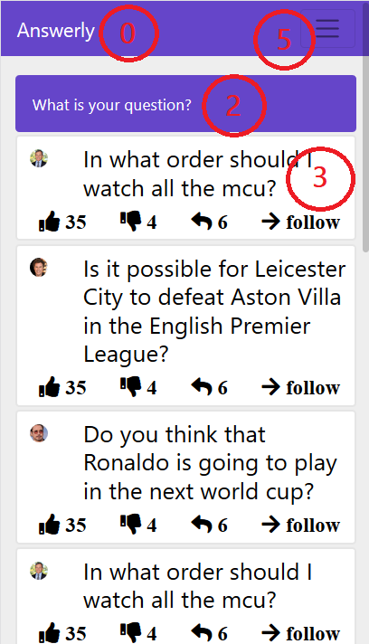 | 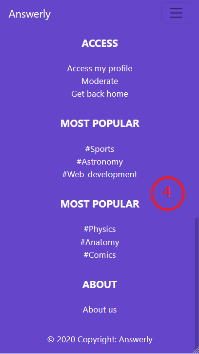 

Figure 1.a: Home Page.

0. Answerly button to go back to the main page;
1. Ask a question button;
2. NavBar;
3. Labels;
4. Preview of a question.

We also developed an individual page for each question so that the user has an easier time looking through more details about the questions.

In each question we can see the full description of the question and additional information about the author and the question's points.

Following the description we will be able to find answers for the questions which can receive votes from other users whether it is helpful or not.

There will also a section with users to post comments if they want to give a insight about something in particular. 

|Desktop | Mobile | |
|:-------------------------:|:-------------------------:|:-------------------------:|
|  |  | 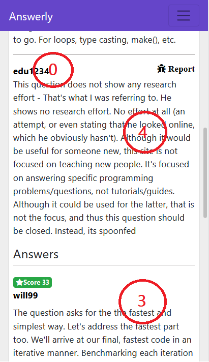 |
| 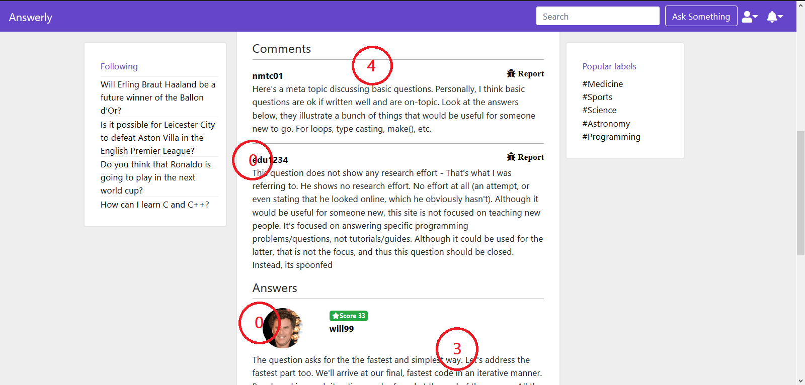 |  

Figure 1.b: Question Interface.

0. Access account's profile;
1. Upvote and downvote buttons;
2. Question;
3. Answer a question and see other answers;
4. Add a comment and see other comments;

## 2. Sitemap

Here below we can find a sitemap representing the overall structure of the project.
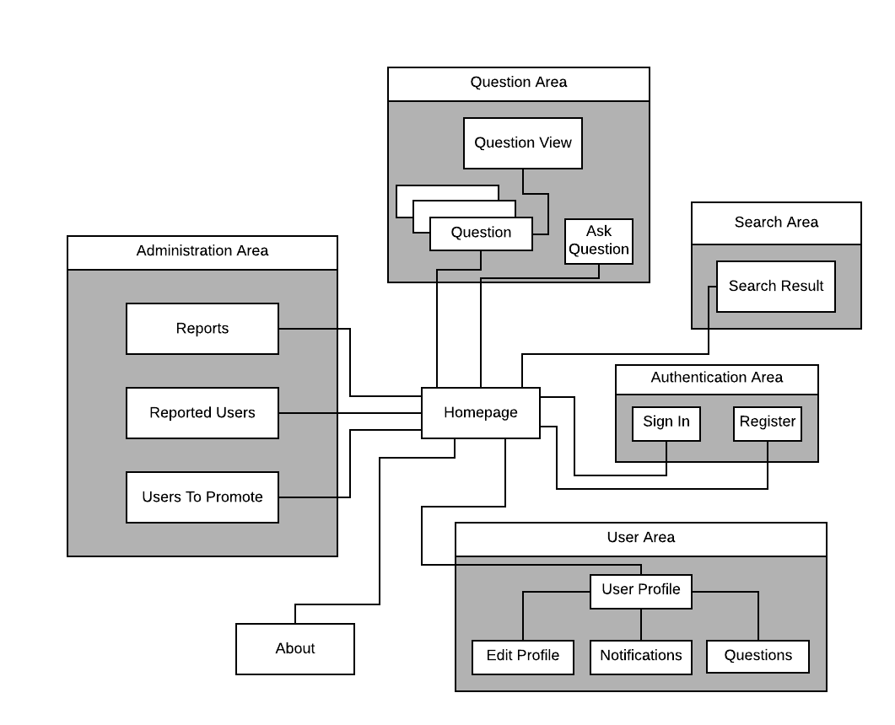
Figure 2: Sitemap.

## 3. Storyboards

**Figure 3.a and 3.b**: This is login page of the website. Here the user can access to the homepage(2) by logging in with the correct credentials. We also give the option for the user to register into the website(1) or search for questions while not authenticated (3).
Below we also list the most popular questions, giving the user the option to check the question's page(4) or the profile of the user that asked it(5).

**Figure 3.c**: After the user has introduced its information, he can press the register button and go directly to the homepage(2).

**Figure 3.d:** In the homepage the user is presented several questions that are of his interest. He can find questions of a specific topic (3), ask a question(6), check a question's page(4) or user(5), go to his profile(5), check his notifications(7) or search for a question(3). All the actions presented in the navbar are common to all the pages that present that same navbar.

**Figure 3.e**: Here the user is with the results of his search, being able to access the question's page he so desires(4).

**Figure 3.f and 3.g**: In the question's page, the user is able to access the profile of the users that interacted wit the question(question, answer and comments). He can also answer the question or leave a comment(4)

**Figure 3.h and 3.i and 3.j**: In the user profile, he is able to check his information and how his profile is presented to others. Besides that, he can check any notifications(7) he may have gotten or edit his own profile information(8).

**Figure 3.k**: Here the user may write a question of his liking  and submmiting any media he may want, and when he is done, press the "Add" button to go to the homepage and his question will be added to the website(2).
In this photo we can also see the website footer that is foound in all the website's pages with links for the various pages refered above.

**Figure 3.l**: This is the about page where the user is presented information about this project. He may leave the page by using the searchbar. (E.g. Number 2 for Homepage).

Figure 3: Storyboard.

## 4. Interfaces

The following section show a brief description of the content you will be able to find in each page as well as as images of the interface, in both  esktop and mobile

#### UI01: Sign In
This page has the option for the User to sign in to the website and below you'll find some of the most popular questions on *Answerly*

|Desktop           |  Mobile |
|:-------------------------:|:-------------------------:|
|  |    | 
|  |    | 

**Figure 4**: [Sign In](http://lbaw2064-piu.lbaw-prod.fe.up.pt/)

#### UI02: Home
Main website page where you scroll through the most popular questions, interact with questions, search for a specific question or ask one of your own.
v
Desktop           |  Mobile
:-------------------------:|:-------------------------:
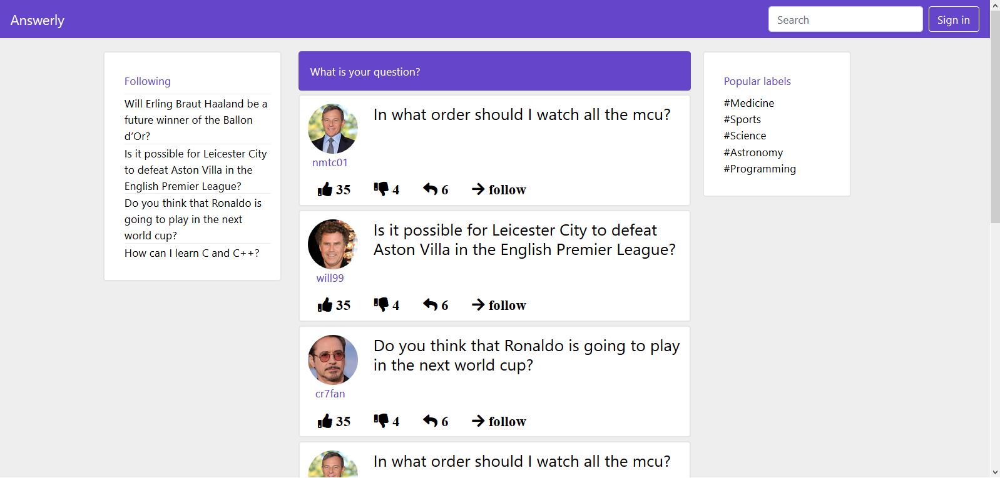  |  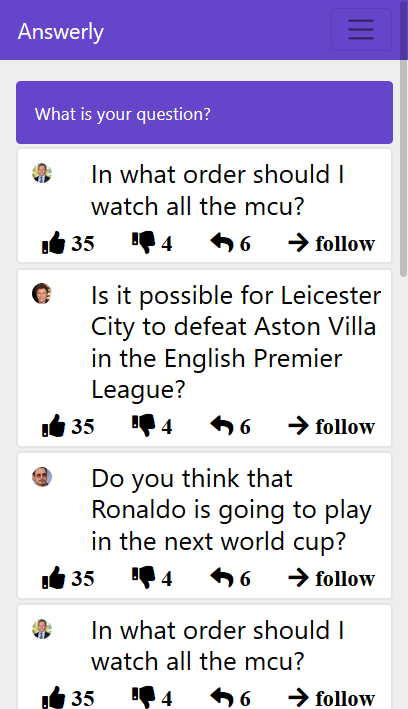

**Figure 5**: [Home](http://lbaw2064-piu.lbaw-prod.fe.up.pt/pages/home.php)

#### UI03: Question
This page gives a more detailed view of the question, with all of its answers and comments. You can also find the Profile of the user that asked the question and interact with the page by liking or sharing the question, comments or answers.

Desktop           |  Mobile |  |
:-------------------------:|:-------------------------|:-------------------------:
  |  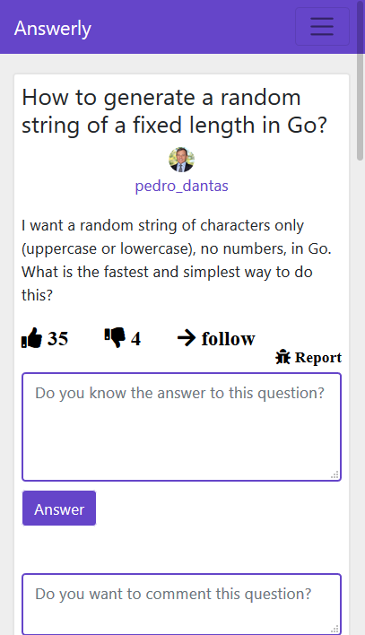 | 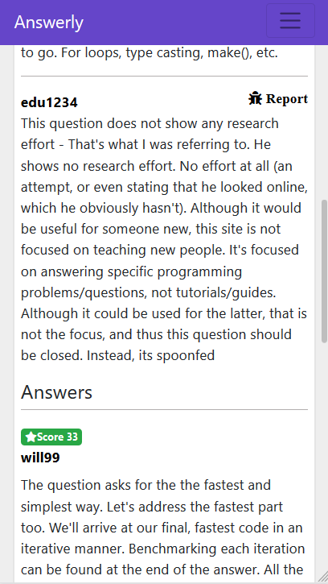 |
  | 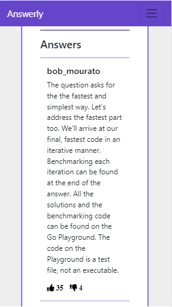 | 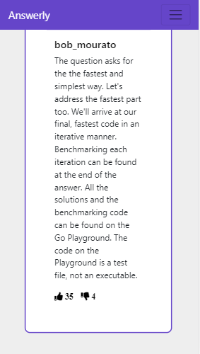 |

**Figure 6**: [Question](http://lbaw2064-piu.lbaw-prod.fe.up.pt/pages/question.php)

#### UI04: Ask
In this page the user will be able to post a question of his own, inserting media like pictures or videos if he so desires.

Desktop           |  Mobile
:-------------------------:|:-------------------------:
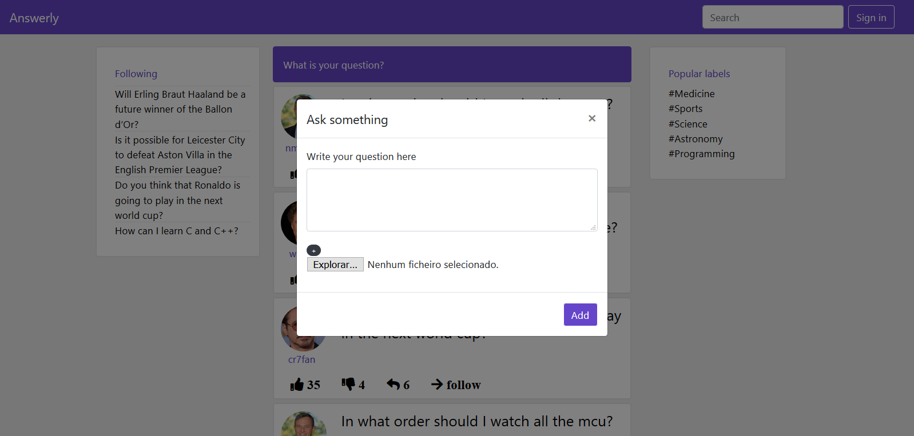  |  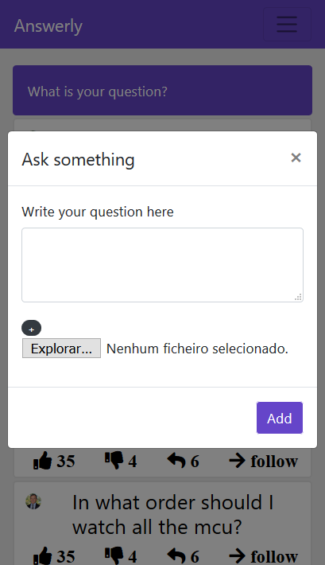 |

**Figure 7**: [Ask](http://lbaw2064-piu.lbaw-prod.fe.up.pt/pages/ask.php)

#### UI05: Moderator/Admin
In this page the moderators will be able to see profiles and questions/answers/comments that were reported. The admin page is exactly the same but also has the Promotion section where users and moderators can be promoted/demoted.

Desktop           |  Mobile
:-------------------------:|:-------------------------:
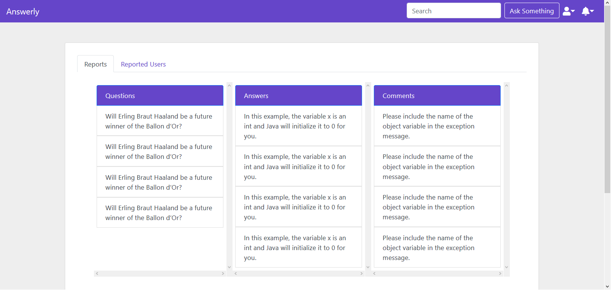  |   |
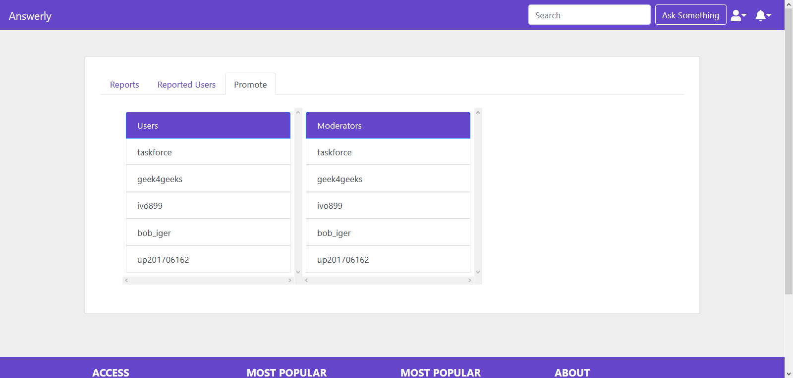  |  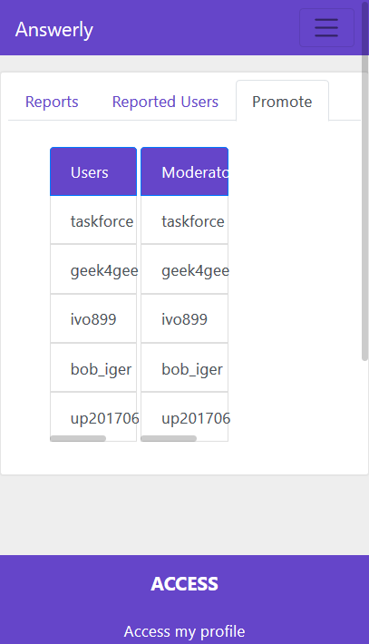 |

**Figure 8**: Moderation Area: [Admin](http://lbaw2064-piu.lbaw-prod.fe.up.pt/pages/admin.php);
[Moderator](http://lbaw2064-piu.lbaw-prod.fe.up.pt/pages/moderator.php)

#### UI06: Profile
This page consists in the User's profile. Here he'll be able to Edit its information and also view any notifications he might have

Desktop           |  Mobile
:-------------------------:|:-------------------------:
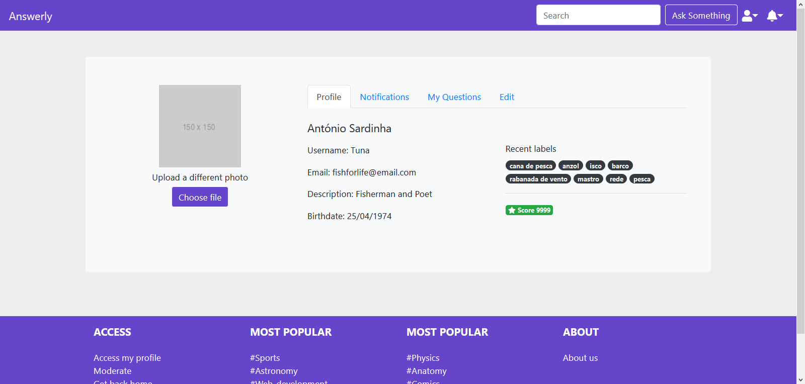  |  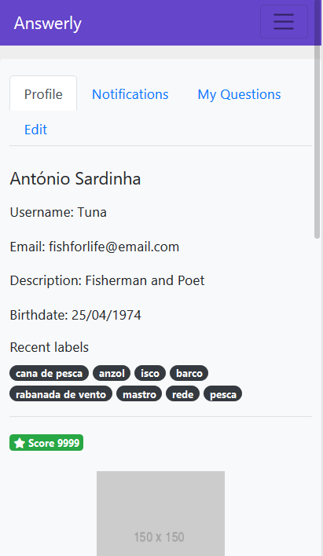 |
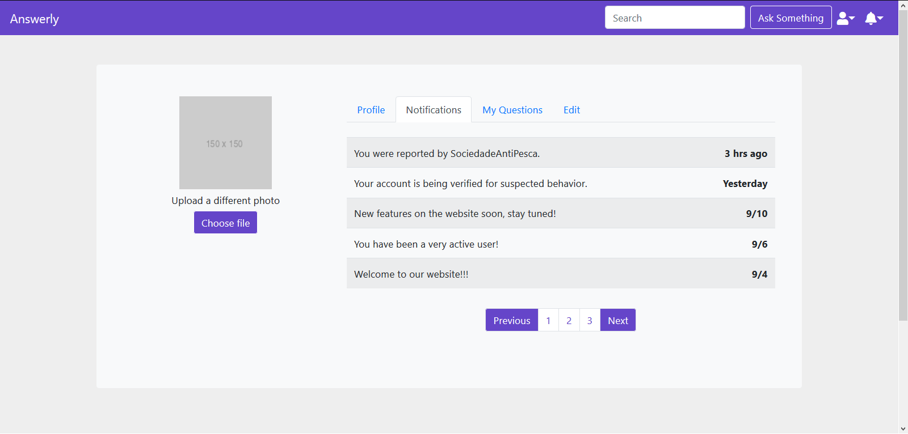  |   |
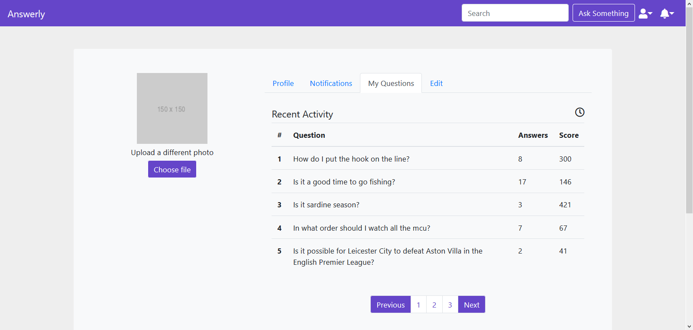  |  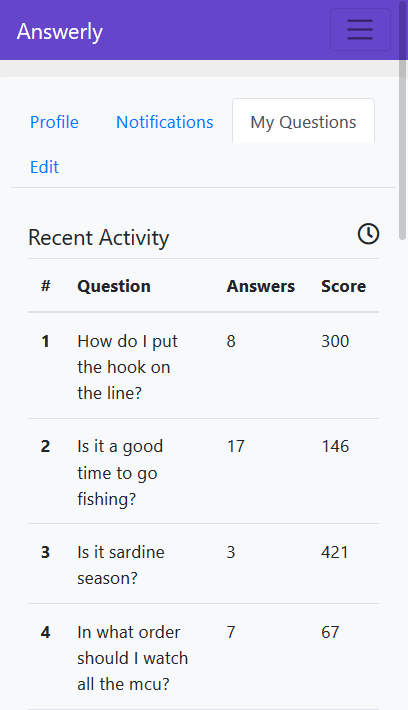 |

**Figure 9**: [Profile](http://lbaw2064-piu.lbaw-prod.fe.up.pt/pages/profile.php)

#### UI07: Register
This is the page where a User can register into the website.

Desktop           |  Mobile
:-------------------------:|:-------------------------:
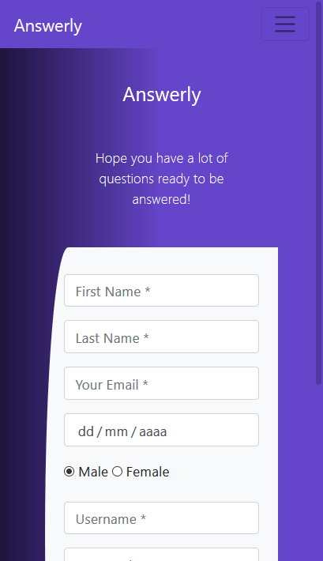  |  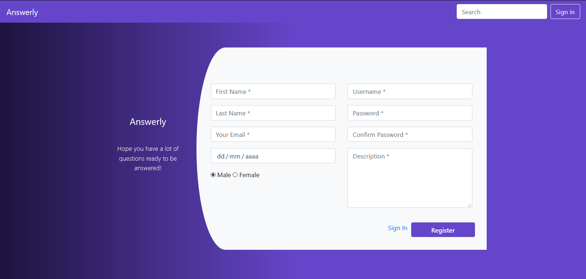 |

**Figure 10**: [Register](http://lbaw2064-piu.lbaw-prod.fe.up.pt/pages/register.php)

#### UI08: Search
Page that retrieves the results of a User search.

Desktop           |  Mobile
:-------------------------:|:-------------------------:
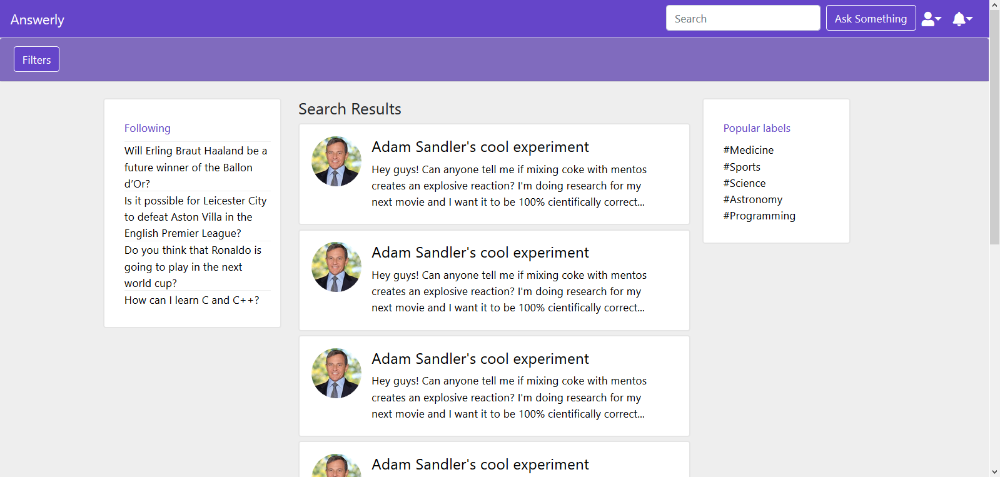 |   |

**Figure 11**: [Search](http://lbaw2064-piu.lbaw-prod.fe.up.pt/pages/search.php)

#### UI09: About

The purpose of this page is for the user to find a specific question or questions about a specific topic

Desktop           |  Mobile
:-------------------------:|:-------------------------:
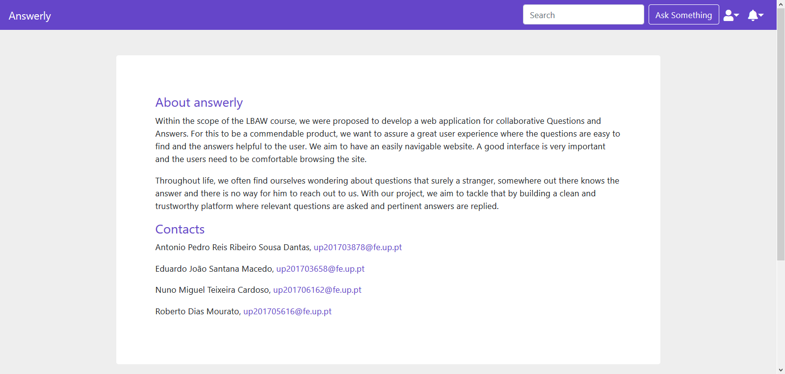  | 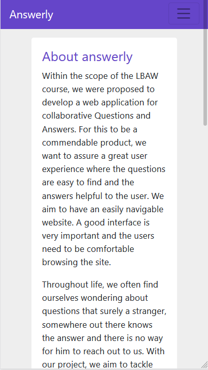 |

**Figure 12**: [About](http://lbaw2064-piu.lbaw-prod.fe.up.pt/pages/about.php)

### A1. Annexes
Hand-made wireflows of the desktop version of the website

Hand-made wireflows of the mobile version of the website

## Revision history
1. First submission (09/03/2020).

------

GROUP2064, 09/03/2020

- Antonio Pedro Reis Ribeiro Sousa Dantas, up201703878@fe.up.pt
- [Editor] Eduardo João Santana Macedo, up201703658@fe.up.pt
- Nuno Miguel Teixeira Cardoso, up201706162@fe.up.pt
- Paulo Roberto Dias Mourato, up201705616@fe.up.pt
