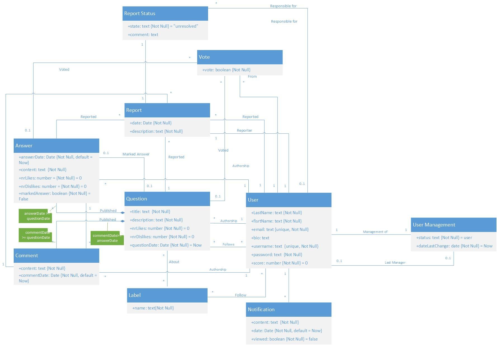

# A4: Conceptual Data Model

Our project, Answerly, is a web application for collaborative Questions and Answers.
This artifact consists in the Conceptual Domain Model, containing the UML class diagram showing the identification, description and relation between the many identities of the project.

**Figure 1:** Class diagram
## 2. Additional Business Rules

| Identifier | Name | Description |
| --- | --- | --- |
| BR01 | Voting | Users can't vote on their own answers or questions. |
| BR02 | Correct Answer | A question can only have one answer marked as correct at most. |
| BR03 | Report State | A report can only have 3 states and in this order: unresolved, processing, resolved. |
| BR03 | Minimum Description | A question's description must have a minimum number of characters to prevent simple questions to be posted. |
| BR04 | Report Responable | A report may have no one reponsable for ir or either one administrator or one moderator. |
| BR05 | Likes and Dislikes | The number of likes and dislikes in questions and answers result from the number of occurences of that event in the Vote class. |
| BR06 | Score | The user's score is the result of the sum of all the likes of its questions and answers subtracted by all the dislikes from all of its questions and answers. |

***

## Revision history
1. First submission (16/03/2020).
2. Updated the UML diagram adding new entities: Vote, Report Status and User management. Added new Business Rules accordingly. (22/03/2020)
------

GROUP2064, 22/03/2020
- Antonio Pedro Reis Ribeiro Sousa Dantas, up201703878@fe.up.pt
- Eduardo João Santana Macedo, up201703658@fe.up.pt
- Nuno Miguel Teixeira Cardoso, up201706162@fe.up.pt
- [Editor] Paulo Roberto Dias Mourato, up201705616@fe.up.pt
